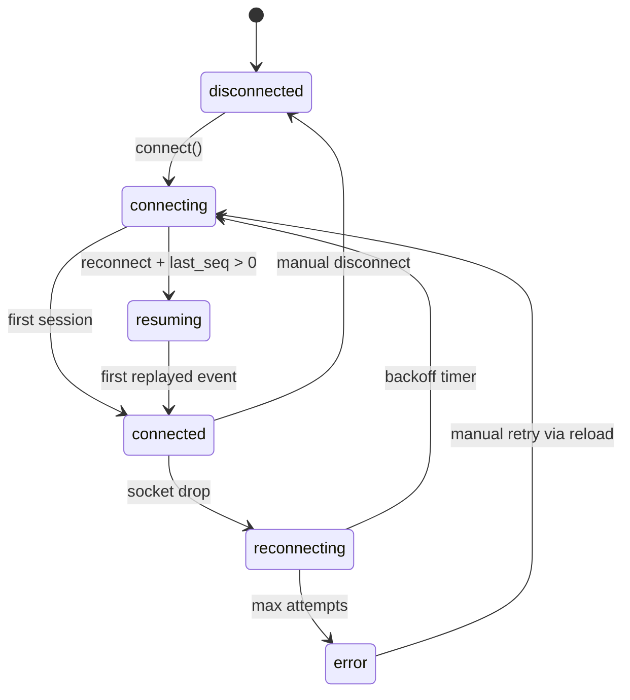

# Agent Console

Next.js client for the Alchemyst mock agent server. It streams tokens, interrupts for tool calls, keeps a protocol trace, inspects context snapshots, and reconnects with `RESUME` when the socket drops.

## Architecture

Three concerns stay separated:

1. **`WebSocketManager`** — socket lifecycle, seq reordering, ping/pong, reconnect backoff, `RESUME`.
2. **`appState` reducer + `streamState` helpers** — chat layout as token segments with tool cards pinned after the frozen prefix.
3. **UI panels** — chat, trace timeline, context inspector. Timeline token rows are batched before they hit React state.



## Run locally

```bash
# backend (from assignment bundle)
cd ../hiring/June-2026_FullStackAI/agent-server
docker build -t agent-server .
docker run -p 4747:4747 agent-server

# frontend
cd agent-console
npm install
npm test
npm run dev
```

Production build:

```bash
npm run build
npm run start
```

Chaos mode:

```bash
docker run -p 4747:4747 agent-server --mode chaos
```

Verify protocol behaviour:

```bash
curl -s http://localhost:4747/log | jq .
```

## Screenshots

Add these before submission (normal mode):

1. `docs/screenshots/stream-with-tool.png` — streamed answer with a tool card mid-response
2. `docs/screenshots/trace-timeline.png` — trace panel with batched token row expanded
3. `docs/screenshots/context-diff.png` — context inspector on snapshot 2+ with diff colours

## Chaos recording

Record 3–5 minutes against `--mode chaos`, labelling each scenario listed in the assignment. Place the file at `docs/chaos-demo.mp4` or link it in your submission email.

## Tests

```bash
npm test
```

Covers the reordering buffer (duplicates, reversed seq, gaps), stream segment ordering around tool calls, and JSON diff helpers.

## Project layout

```
src/
  app/                 Next.js shell
  components/          chat, trace, context, input
  lib/
    websocketManager.ts
    reorderingBuffer.ts
    streamState.ts
    timelineAccumulator.ts
    appState.ts
    jsonDiff.ts
  types/protocol.ts
```

More detail on trade-offs: see `DECISIONS.md`.
